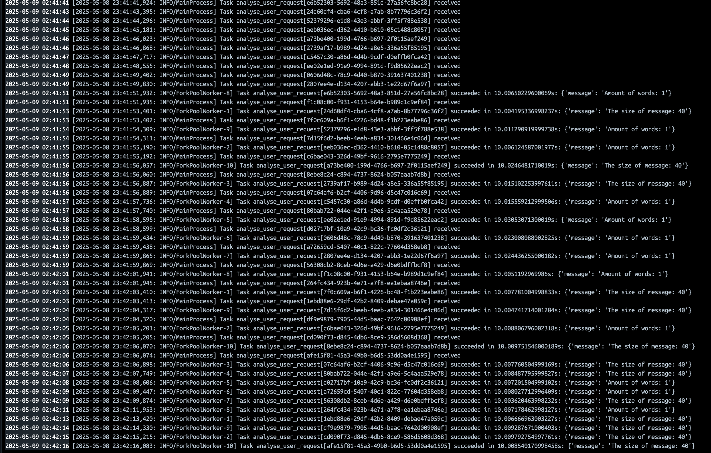

## ARCHITECTURE OVERVIEW

- **CLIENT SERVICE**: the only service directly accessible by users. It exposes endpoints for checking health status, retrieving service descriptions, submitting tasks to the business service, and checking the status of submitted tasks. It also includes an alert engine that detects suspicious inputs, invalid data, or personal data, and generates alert reports that are stored in the *error_reports* directory
- **BUSINESS SERVICE**: service simulates the behavior of a large language model (LLM). Each task includes a hardcoded 10-second delay to simulate processing time. It delegates tasks to two Celery workers by pushing them to Redis. It also handles tracking and returning the status of submitted tasks to the client service
- **REDIS**: service is used as a broker for Celery. It receives task messages from the business service and stores them in a queue. Then, Celery workers pull those messages from Redis to execute the tasks
- **CELERY WORKERS**: services that execute background tasks pulled from Redis. In this setup, they simulate the work of LLMs (as described in the business-service). While workers don’t send results back to Redis by default, task status and results can be stored in Redis if result backends are configured that way
- **INFLUX DB**: a time-series database used to store logs generated by all services (except Redis). These logs can include task states, performance metrics, and error tracking for monitoring and observability

**Synchronous**: all operations in client service (get description, get health status, submit task, get task status, write logs) and almost all operations in business service (get description, get health status, task status, generate task, write logs).

**Asynchronous**: the only asynchronous function is `analyse_user_request`, which is a Celery task. Since Celery tasks are designed to run asynchronously, this function must be defined as such.

## RESOURCE SCALING ESTIMATION
Comment: we don't need much instances when dealing with low-I/O operations (like submitting tasks), so amount of business services and client services we should remain low in each case. Also, because workers can run simultaneously more than one task, we also don't need to have big amount of worker instances (25 tasks in 35 seconds).



- **First Case (10 simultaneous connections)**: we can use default configuration for this case, because 2 workers can process 80 tasks in one minute.

- **Second Case (50 simultaneous connections)**: in this case we only need to increase amount of workers to 6, so time "from queue to worker" was acceptable (approx. 10 seconds). Also we should vertically scale InfluxDB cause amount of generated logs will increase.

- **Third Case (100 or more simultaneous connections)**: this case require more scaling:
  - **Client Service**: 2-3 instances with auto-scaling and a load balancer to absorb high request volume.
  - **Business Service**: 2-3 instances to handle concurrent task delegation and tracking efficiently.
  - **Redis**: remain the same.
  - **Celery Workers**: scale up to **12 workers** to ensure that system can process more than 100 tasks in acceptable time (~10 seconds). Additionally, implementing autoscaling will help dynamically adjust the number of workers based on the workload, preventing unnecessary resource allocation and cost while maintaining optimal performance.
  - **InfluxDB**: we will have lots of logs, so we need to move to a clustered setup or use a cloud-hosted InfluxDB service to ensure write scalability, high availability, and long-term data retention with high ingest rates.


## HOW TO USE
1. Run ```docker compose up``` in terminal
2. Wait 10 seconds for the application to start working
3. Application will be accessible on address **http://localhost:8000**

## RESAULTS
1. Application started

2. Get application description `curl 'http://localhost:8000/'`

3. Submit one task and check worker logs `curl -X POST 'http://localhost:8000/process?message=somecoolmessage'`

4. Submit multiple tasks and check worker logs `curl -X POST 'http://localhost:8000/process?message=somecoolmessage'`

5. Check status of some task and then check it resault `curl 'http://localhost:8000/status/f02a173f-d981-4b5a-9126-3b47318e5c30'`

6. Check the functionality of the alert service `curl -X POST 'http://localhost:8000/process?message=my%20phone%20number%20:+380991414444'`


7. Check all logs (in InfluxDB) `influx query 'from(bucket: "logs") |> range(start: -1h)'` <- run in influxdb container


## NOTA BENE
Image for logs (./assets/logs.png) was taken after restart of compose, so it doesn't represent history of previous steps