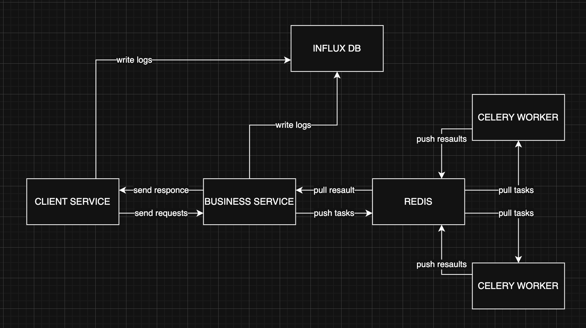

## ARCHITECTURE OVERVIEW

- **CLIENT SERVICE**: the only service directly accessible by users. It exposes endpoints for checking health status, retrieving service descriptions, submitting tasks to the business service, and checking the status of submitted tasks. It also includes an alert engine that detects suspicious inputs, invalid data, or personal data, and generates alert reports that are stored in the *error_reports* directory
- **BUSINESS SERVICE**: service simulates the behavior of a large language model (LLM). Each task includes a hardcoded 10-second delay to simulate processing time. It delegates tasks to two Celery workers by pushing them to Redis. It also handles tracking and returning the status of submitted tasks to the client service
- **REDIS**: service is used as a broker for Celery. It receives task messages from the business service and stores them in a queue. Then, Celery workers pull those messages from Redis to execute the tasks
- **CELERY WORKERS**: services that execute background tasks pulled from Redis. In this setup, they simulate the work of LLMs (as described in the business-service). While workers don’t send results back to Redis by default, task status and results can be stored in Redis if result backends are configured that way
- **INFLUX DB**: a time-series database used to store logs generated by all services (except Redis). These logs can include task states, performance metrics, and error tracking for monitoring and observability

**Synchronous**: all operations in client service (get description, get health status, submit task, get task status, write logs), 

**Asynchronous**: all operations in business service (get description, get health status, submit task and, task status, generate task, write logs). While most of these operations (except generate task `analyse_user_request`, because it always behaves as asynchronous function) could technically be synchronous, logging requires them to be asynchronous for proper functioning. Therefore, in the current design, all are kept async to ensure consistent logging behavior.

## RESOURCE SCALING ESTIMATION
- **First Case (10 simultaneous connections)**  
  At this level of traffic, the system should function well with minimal infrastructure changes:
  - **Client Service**: single instance should be sufficient to handle HTTP requests and perform basic validation and alerting.
  - **Business Service**: one instance can manage task submission and tracking, given the low volume of requests.
  - **Redis**: single Redis instance will handle message brokering without bottlenecks.
  - **Celery Workers**: 6-8 workers are sufficient to process tasks with the 10-second delay, resulting in a maximum theoretical throughput of 48 tasks/minute.
  - **InfluxDB**: a single-node setup should be sufficient for logging and monitoring purposes.

- **Second Case (50 simultaneous connections)**  
  As concurrency increases, system components must scale to maintain responsiveness and prevent queuing delays:
  - **Client Service**: scale horizontally to 2–3 instances behind a load balancer to distribute incoming traffic and reduce latency, so user will wait less to submit their tasks.
  - **Business Service**: increase to 2 instances to handle task submissions from 2-3 client services concurrently and reduce latency in task tracking.
  - **Redis**: still sufficient.
  - **Celery Workers**: Increase to 12–16 workers to ensure timely task processing. With a average 10-second processing time per task, this setup can handle 72–96 tasks per minute.
  - **InfluxDB**: scale vertically or enable retention policies to handle increased write loads from more frequent logging.

- **Third Case (100 or more simultaneous connections)**  
  The system needs to be fully scalable and resilient to handle high concurrency and potential spikes:
  - **Client Service**: 4–6 instances with auto-scaling and a load balancer to absorb high request volume.
  - **Business Service**: 4–5 instances to handle concurrent task delegation and tracking efficiently.
  - **Redis**: consider clustering.
  - **Celery Workers**: scale to **24–36 workers** to ensure that system can process more than 100 tasks in 1 minute (144-216 tasks/minute). Additionally, implementing autoscaling will help dynamically adjust the number of workers based on the workload, preventing unnecessary resource allocation and cost while maintaining optimal performance.
  - **InfluxDB**: move to a clustered setup or use a cloud-hosted InfluxDB service to ensure write scalability, high availability, and long-term data retention with high ingest rates.

Comment: we don't need much instances when dealing with low-I/O operations (like submitting tasks), so amount of business services and client services we should remain low.

## HOW TO USE
1. Run ```docker compose up``` in terminal
2. Wait 10 seconds for the application to start working
3. Application will be accessible on address **http://localhost:8000**

## RESAULTS
1. Application started

2. Get application description `curl 'http://localhost:8000/'`

3. Submit one task and check worker logs `curl -X POST 'http://localhost:8000/process?message=somecoolmessage'`

4. Submit multiple tasks and check worker logs `curl -X POST 'http://localhost:8000/process?message=somecoolmessage'`

5. Check status of some task and then check it resault `curl 'http://localhost:8000/status/{task_id}'`

6. Check the functionality of the alert service `curl -X POST 'http://localhost:8000/process?message=my%20phone%20number%20:+380991414444'`


7. Check all logs (in InfluxDB) `influx query 'from(bucket: "logs") |> range(start: -1h)'` <- run in influxdb container


## NOTA BENE
Image for logs (./assets/logs.png) was taken after restart of compose, so it doesn't represent history of previous steps